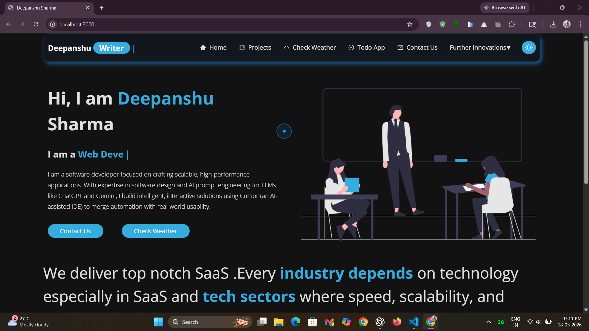
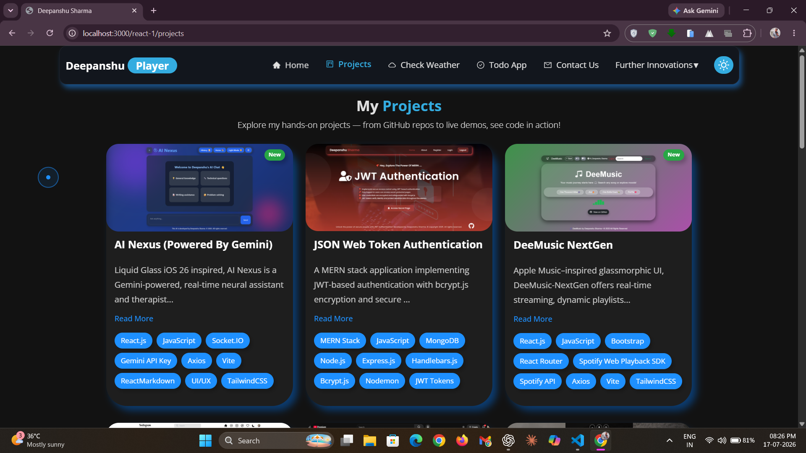
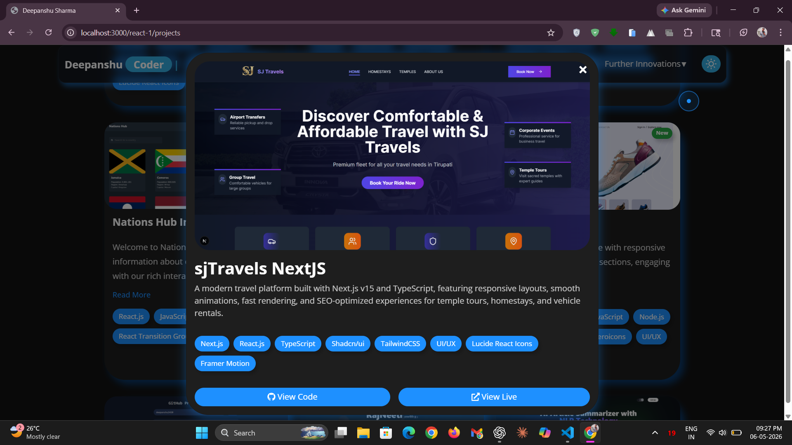
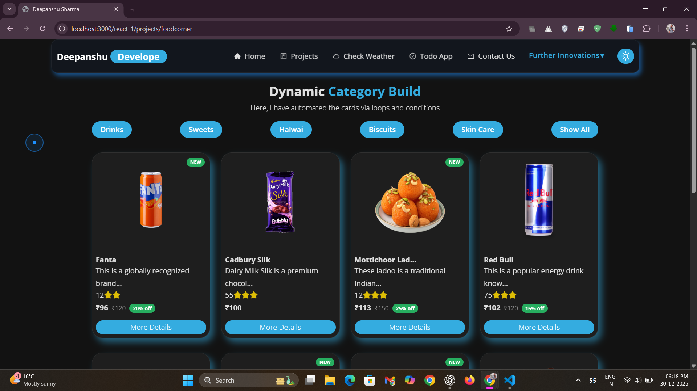
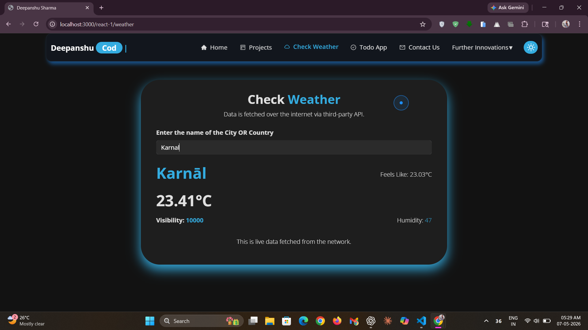
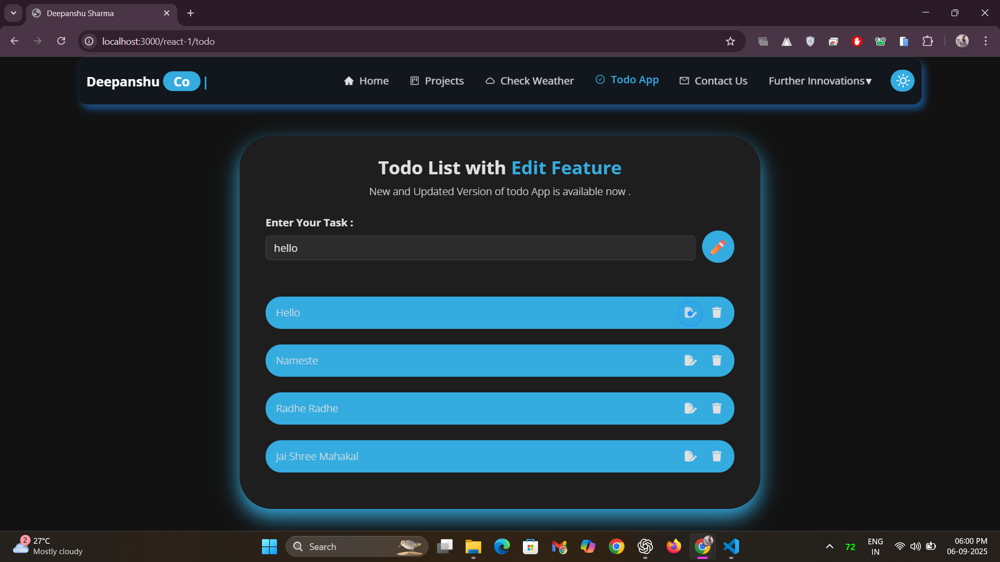

# 💼 Developer's Portfolio

[](https://reactjs.org/) 
[](https://developer.mozilla.org/en-US/docs/Web/JavaScript) 
[](https://greensock.com/gsap/) 
[](https://mattboldt.com/demos/typed-js/) 
[](https://www.npmjs.com/package/react-type-animation) 
[](https://react-icons.github.io/react-icons/) 
[](https://getbootstrap.com/) 
[](https://reactrouter.com/en/main) 
[](https://developer.mozilla.org/en-US/docs/Web/HTML) 
[](https://developer.mozilla.org/en-US/docs/Web/CSS) 
[](LICENSE)

**A modern, responsive developer's portfolio built with React.js, JavaScript (ES6), Bootstrap, React Router, GSAP, and CSS3/HTML5 — delivering scalability, interactivity, and a seamless user experience.**    
&nbsp;  
🌐 **[Click to Know About Me](https://personalportfolio-online.netlify.app/)**  

## 🌟 Overview
This portfolio consolidates an interactive project showcase, detailed skillset visualization, personal profile insights, and a dynamic contact hub within a streamlined, responsive interface — architected for scalability, performance, and immersive user engagement.  

## ⚡ Features & Highlights
- **Project Showcase with Modals:** Interactive project cards that open a modal for a detailed view, including links to the live project and GitHub repository.  
- **New Badge for Recent Projects:** Keeps the portfolio fresh and highlights new work instantly.  
- **Responsive Design:** Fully optimized for desktops, tablets, and mobile devices.  
- **React.js Components:** Modular, maintainable, and reusable UI components.  
- **Dynamic Theme Switching:** Toggle between light and dark themes for a personalized viewing experience.  
- **Custom Cursor Tracker:** An interactive cursor enhances the user experience.  
- **Read More/Less for Project Descriptions:** Expand or collapse project descriptions to keep the layout clean.  
- **Smooth Animations:** GSAP-powered animations for engaging transitions and interactions.  
- **Performance Optimized:** Lazy loading and efficient asset handling for faster load times.  

## ✅ Advantages
- Creates a **professional online presence** to showcase skills and projects.  
- **Interactive and engaging UI** with smooth transitions and animations.  
- **Accessible across all devices** with mobile-first responsive design.  
- **Easily customizable** thanks to modular React.js components.  
- **Built for scalability**—new projects and sections can be added quickly.  
- **SEO-friendly structure** to improve discoverability.  
- **Fast load times** through optimized assets and code splitting.  

## 📷 Screenshots / Demo
Here are some previews of my portfolio to showcase its design and features:  

### 🏠 Home Page
  
*Clean and modern landing page introducing me and my portfolio.*  

### 📂 Projects Section
  
*Projects overview displaying recent work with "New" badges.*  

### 📝 Project Card Previews
  
*Interactive project cards with modals, live links, and GitHub links.*  

### 🍴 Food Corner (Further Innovations)
  
*Food Corner section with interactive food details, highlighting product rates, discounts, and engaging previews.*  

### 🌦 Weather App
  
*A weather app built with real-time API integration and responsive design.*  

### 📋 Todo App
  
*A todo app featuring add, delete, and **edit** functionality for tasks.*  

## 🛠 Installation

```bash
# Clone the repository
git clone https://github.com/deepanshu1420/PersonalPortfolio-React.git

# Navigate to the project folder
cd PersonalPortfolio-React

# Install dependencies
npm install

# Start the development server
npm start
